# Plan de développement par lots — Planificateur de repas

Ce document décrit le découpage du projet en **lots** indépendants, livrables et reviewables. Chaque lot correspond à une unité de travail cohérente, poussée sur une branche dédiée et fusionnée via **une pull request (PR)**.

---

## Règles de livraison

| Règle | Détail |
|-------|--------|
| **Une branche par lot** | Nommage suggéré : `lot-01-init`, `lot-02-modeles-stub`, etc. |
| **Une PR par push de lot** | À chaque fin de lot : push de la branche → ouverture d'une PR vers `main` (ou `develop`) |
| **PR reviewable** | Description de la PR : objectif du lot, checklist des tâches, captures d'écran si UI |
| **Merge séquentiel** | Lot *N+1* part de la branche de base à jour après merge du lot *N* |
| **Build vert** | `npm run build` doit passer avant ouverture de la PR |

### Modèle de description PR

```markdown
## Lot XX — [Titre]

### Objectif
[Résumé en une phrase]

### Tâches réalisées
- [ ] …
- [ ] …

### Test plan
- [ ] `npm start` — …
- [ ] `npm run build` — compilation OK
```

---

## Périmètre fonctionnel cible

Par rapport à la maquette actuelle, le produit final visé par ces lots :

- **Repas conservés** : déjeuner (`lunch`) et dîner (`dinner`) uniquement — pas de petit-déjeuner
- **Création de recettes** : formulaire avec ingrédients saisis un par un (nom, quantité, unité)
- **Remplissage des créneaux vides** : assignation d'une recette locale **ou** import depuis une **API libre** (TheMealDB recommandée — sans clé API)
- **Données stub** en phase initiale, puis persistance locale progressive

---

## Vue d'ensemble des lots

| Lot | Intitulé | Livrable principal |
|-----|----------|-------------------|
| 01 | Initialisation | Projet Angular, routing, styles globaux |
| 02 | Modèles & données stub | Types, 10 recettes stub, service de base |
| 03 | Grille hebdomadaire | Planning 7 jours × 2 repas (midi / soir) |
| 04 | Détail recette | Panneau latéral au clic sur un repas |
| 05 | Navigation & statistiques | Semaines prev/next, indicateurs |
| 06 | Liste de courses | Agrégation ingrédients, cases à cocher |
| 07 | Création de recettes | Formulaire + ingrédients dynamiques |
| 08 | Assignation locale | Remplir un slot vide depuis les recettes enregistrées |
| 09 | Import API externe | Recherche TheMealDB + assignation / enregistrement |
| 10 | Finition & persistance | localStorage, UX, gestion d'erreurs |

---

## Lot 01 — Initialisation du projet

**Branche** : `lot-01-init`  
**PR** : `Lot 01 — Initialisation du projet Angular`

### Objectif

Poser le squelette Angular sans logique métier.

### Tâches

- [ ] Créer le projet Angular (standalone, SCSS, routing)
- [ ] Configurer `app.routes.ts` avec une route par défaut vers la page planner
- [ ] Définir les variables CSS globales (`styles.scss`) : couleurs, rayons, ombres
- [ ] Créer le composant shell `AppComponent` (router-outlet uniquement)
- [ ] Créer la page vide `PlannerComponent` (titre + placeholder)
- [ ] Vérifier `npm start` et `npm run build`

### Critères d'acceptation

- Application accessible sur `http://localhost:4200`
- Build production sans erreur

---

## Lot 02 — Modèles & données stub

**Branche** : `lot-02-modeles-stub`  
**PR** : `Lot 02 — Modèles TypeScript et données stub`

### Objectif

Formaliser le domaine métier et fournir des données de démonstration.

### Tâches

- [ ] Créer `models/meal.models.ts` :
  - `MealType = 'lunch' | 'dinner'` (**pas de breakfast**)
  - `Ingredient` : `name`, `quantity`, `unit`
  - `Recipe` : métadonnées + `ingredients[]`
  - `PlannedMeal` : `id`, `date`, `mealType`, `recipeId`
  - Constantes `MEAL_TYPE_LABELS` et `MEAL_TYPE_ICONS`
- [ ] Créer `data/stub.data.ts` :
  - 10 recettes stub avec ingrédients quantifiés individuellement
  - Fonction `generateStubPlan(referenceDate)` — **2 repas par jour** (midi + soir)
  - Liste de courses stub initiale
- [ ] Créer `services/meal-planner.service.ts` :
  - Signals : `weekOffset`, `selectedRecipeId`, `plannedMeals`, `recipes`
  - Méthodes : `getRecipe`, `getMealForSlot`, `selectRecipe`
  - Calcul du lundi de la semaine courante

### Critères d'acceptation

- Le service expose les recettes stub et un planning sur 7 jours × 2 repas
- Aucune référence à `breakfast` dans le code

---

## Lot 03 — Grille hebdomadaire

**Branche** : `lot-03-grille-hebdo`  
**PR** : `Lot 03 — Grille de planning hebdomadaire (midi & soir)`

### Objectif

Afficher visuellement le planning de la semaine.

### Tâches

- [ ] Créer `MealSlotComponent` :
  - Affichage emoji, nom, durée, calories si recette présente
  - État vide : libellé « + Ajouter un repas » (cliquable, sans action pour l'instant)
  - État sélectionné (bordure active)
- [ ] Mettre à jour `PlannerComponent` :
  - Grille CSS : colonne libellés repas + 7 colonnes jours
  - En-têtes jours (nom, date, surbrillance du jour courant)
  - 2 lignes de repas : Déjeuner 🍽️, Dîner 🌙
- [ ] Styles responsive (scroll horizontal sur mobile)

### Critères d'acceptation

- 14 cellules repas visibles (7 jours × 2 repas)
- Les repas stub s'affichent correctement dans la grille

---

## Lot 04 — Détail recette

**Branche** : `lot-04-detail-recette`  
**PR** : `Lot 04 — Panneau de détail recette`

### Objectif

Consulter le détail d'un repas planifié.

### Tâches

- [ ] Créer `RecipePanelComponent` :
  - Affichage conditionnel selon `selectedRecipe`
  - Nom, description, tags, temps, portions, calories
  - Liste des ingrédients avec **quantité + unité + nom** sur chaque ligne
  - État vide : message invitant à sélectionner un repas
- [ ] Lier le clic sur un `MealSlot` à `planner.selectRecipe(recipeId)`
- [ ] Layout planner : grille principale + panneau latéral droit

### Critères d'acceptation

- Clic sur un repas planifié → détail affiché dans le panneau
- Clic sur un autre repas → panneau mis à jour

---

## Lot 05 — Navigation & statistiques

**Branche** : `lot-05-navigation-stats`  
**PR** : `Lot 05 — Navigation par semaine et statistiques`

### Objectif

Naviguer entre les semaines et afficher des indicateurs synthétiques.

### Tâches

- [ ] Boutons semaine précédente / suivante
- [ ] Clic sur la plage de dates → retour semaine courante (`weekOffset = 0`)
- [ ] Libellé de semaine en français (ex. « 23 juin – 29 juin »)
- [ ] Cartes statistiques :
  - Repas planifiés (sur 14 créneaux max)
  - Recettes différentes
  - Calories moyennes par repas
  - Total calorique de la semaine
- [ ] Réinitialiser la sélection recette lors du changement de semaine

### Critères d'acceptation

- Navigation fonctionnelle sur plusieurs semaines
- Stats recalculées à chaque changement de semaine

---

## Lot 06 — Liste de courses

**Branche** : `lot-06-liste-courses`  
**PR** : `Lot 06 — Liste de courses agrégée`

### Objectif

Générer une liste de courses à partir des repas planifiés.

### Tâches

- [ ] Créer `ShoppingListComponent`
- [ ] Méthode `aggregateIngredients(recipeIds)` dans le service :
  - Fusionner les ingrédients identiques (même nom + unité) en **additionnant les quantités**
- [ ] Afficher la liste sous la grille avec :
  - Cases à cocher
  - Barre de progression (cochés / total)
  - Texte barré pour les articles cochés
- [ ] Alimenter la liste depuis les recettes de la semaine courante (remplacer le stub statique)

### Critères d'acceptation

- La liste reflète les ingrédients des repas planifiés de la semaine
- Cocher / décocher un article met à jour la progression

---

## Lot 07 — Création de recettes

**Branche** : `lot-07-creation-recettes`  
**PR** : `Lot 07 — Formulaire de création de recettes`

### Objectif

Permettre à l'utilisateur de créer ses propres recettes avec des ingrédients quantifiés individuellement.

### Tâches

- [ ] Créer `RecipeFormComponent` (page ou modal) :
  - Champs : nom, description, temps préparation, temps cuisson, portions, calories, emoji
  - **Liste dynamique d'ingrédients** :
    - Chaque ligne : `nom` | `quantité` (number) | `unité` (select ou texte libre : g, ml, pièces, c. à soupe…)
    - Boutons « + Ajouter un ingrédient » / « Supprimer » par ligne
  - Validation : nom obligatoire, au moins 1 ingrédient avec quantité > 0
- [ ] Étendre `MealPlannerService` :
  - `addRecipe(recipe: Recipe)` — génération d'un `id` unique
  - `recipes` signal incluant stub + recettes utilisateur
- [ ] Route `/recipes/new` ou ouverture modal depuis le planner
- [ ] Retour visuel après création (toast ou redirection)

### Modèle de données ingrédient

```typescript
interface Ingredient {
  name: string;      // ex. "Tomates cerises"
  quantity: number;  // ex. 200
  unit: string;      // ex. "g"
}
```

### Critères d'acceptation

- Création d'une recette avec plusieurs ingrédients distincts
- La nouvelle recette apparaît dans le catalogue local du service
- Chaque ingrédient conserve sa quantité individuelle (pas de chaîne libre type « 200 g tomates »)

---

## Lot 08 — Assignation d'un repas local à un slot vide

**Branche** : `lot-08-assignation-locale`  
**PR** : `Lot 08 — Remplissage des créneaux vides (recettes locales)`

### Objectif

Remplir un créneau vide du planning avec une recette déjà enregistrée (stub ou créée par l'utilisateur).

### Tâches

- [ ] Créer `MealPickerComponent` (modal ou panneau) :
  - Liste / recherche filtrable des recettes locales
  - Aperçu rapide (emoji, nom, durée, calories)
  - Bouton « Assigner à ce créneau »
- [ ] Étendre le service :
  - `assignMeal(dateKey, mealType, recipeId)` — crée ou met à jour un `PlannedMeal`
  - `removeMeal(dateKey, mealType)` — vide un créneau (optionnel)
- [ ] Clic sur un slot vide → ouverture du picker avec contexte (date + type de repas)
- [ ] Clic sur un slot rempli → option « Remplacer » ou « Supprimer » (menu contextuel)
- [ ] Recalcul automatique de la liste de courses après assignation

### Critères d'acceptation

- Un créneau vide peut recevoir une recette locale
- La grille et les stats se mettent à jour immédiatement
- La liste de courses inclut les nouveaux ingrédients

---

## Lot 09 — Import via API libre (TheMealDB)

**Branche** : `lot-09-import-api`  
**PR** : `Lot 09 — Import de recettes via TheMealDB`

### Objectif

Enrichir le planning avec des recettes issues d'une API publique gratuite.

### API recommandée

**[TheMealDB](https://www.themealdb.com/api.php)** — gratuite, sans clé pour les endpoints de base.

| Endpoint | Usage |
|----------|-------|
| `GET https://www.themealdb.com/api/json/v1/1/search.php?s={nom}` | Recherche par nom |
| `GET https://www.themealdb.com/api/json/v1/1/lookup.php?i={idMeal}` | Détail complet |
| `GET https://www.themealdb.com/api/json/v1/1/random.php` | Recette aléatoire |

### Tâches

- [ ] Crer `services/themealdb.service.ts` :
  - `searchMeals(query: string)`
  - `getMealById(id: string)`
  - `getRandomMeal()`
- [ ] Créer un mapper `mapTheMealDbToRecipe(apiMeal): Recipe` :
  - Extraire `strIngredient1…20` + `strMeasure1…20` → tableau `Ingredient[]` avec quantités parsées
  - Mapper nom, instructions → description, image → emoji fallback ou URL image
  - Estimer `prepTime` / `calories` (valeurs par défaut si absentes de l'API)
- [ ] Étendre `MealPickerComponent` avec un onglet **« Rechercher en ligne »** :
  - Champ de recherche + résultats API
  - Bouton « Assigner au créneau » (sans sauvegarde locale)
  - Bouton « Enregistrer & assigner » (ajoute au catalogue local puis assigne)
- [ ] États UI : loading, erreur réseau, aucun résultat
- [ ] Configurer `HttpClient` dans `app.config.ts`

### Mapping mesures TheMealDB → unités

Parser les chaînes `strMeasure` (ex. « 200g », « 1 cup », « 2 ») en `{ quantity, unit }` :
- Nombre seul → `unit: 'pièce'`
- Nombre + unité → séparation regex

### Critères d'acceptation

- Recherche d'une recette en ligne et assignation à un slot vide
- Les ingrédients importés sont structurés individuellement (quantité + unité + nom)
- Gestion gracieuse si l'API est indisponible

---

## Lot 10 — Finition & persistance locale

**Branche** : `lot-10-finition`  
**PR** : `Lot 10 — Persistance, UX et documentation`

### Objectif

Consolider l'application pour un usage quotidien.

### Tâches

- [ ] Persistance `localStorage` :
  - Recettes utilisateur
  - Planning de la semaine (`PlannedMeal[]`)
  - État de la liste de courses (cochés)
- [ ] Hydratation au démarrage + sauvegarde à chaque mutation
- [ ] Gestion des conflits d'ID recette (stub vs utilisateur vs import API)
- [ ] Messages d'erreur / confirmations (suppression recette, vidage créneau)
- [ ] Responsive : panneau recette en overlay sur mobile
- [ ] Mettre à jour `README.md` avec les fonctionnalités finales
- [ ] Revue accessibilité basique (labels, aria, navigation clavier modals)

### Critères d'acceptation

- Rechargement de la page → données conservées
- `npm run build` OK
- Parcours complet testé : créer recette → assigner slot → consulter courses → import API

---

## Dépendances entre lots

```mermaid
flowchart LR
  L01[Lot 01 Init] --> L02[Lot 02 Modèles]
  L02 --> L03[Lot 03 Grille]
  L03 --> L04[Lot 04 Détail]
  L04 --> L05[Lot 05 Navigation]
  L05 --> L06[Lot 06 Courses]
  L06 --> L07[Lot 07 Création recettes]
  L07 --> L08[Lot 08 Assignation locale]
  L08 --> L09[Lot 09 API TheMealDB]
  L09 --> L10[Lot 10 Finition]
```



Les lots 01 à 06 reproduisent la maquette actuelle **adaptée** (midi + soir uniquement).  
Les lots 07 à 09 ajoutent les **nouvelles fonctionnalités** demandées.  
Le lot 10 stabilise le produit.

---

## Écart avec la maquette actuelle

La maquette existante dans ce dépôt inclut encore le **petit-déjeuner** et des slots « + Ajouter » non fonctionnels. Lors de l'application de ce plan :

| Élément maquette actuelle | Action dans le plan |
|---------------------------|---------------------|
| 3 repas / jour (petit-déj, déj, dîner) | Réduire à **2 repas** dès le lot 02 |
| Slots vides décoratifs | Rendre fonctionnels aux lots 08 et 09 |
| Recettes stub uniquement | Compléter par création utilisateur (lot 07) et API (lot 09) |
| Liste de courses statique | Rendre dynamique au lot 06 |

---

## Checklist globale avant merge final

- [ ] 10 PR mergées dans l'ordre
- [ ] Uniquement `lunch` et `dinner` dans `MealType`
- [ ] Création de recettes avec ingrédients quantifiés individuellement
- [ ] Assignation locale sur slot vide
- [ ] Import TheMealDB opérationnel
- [ ] `npm run build` vert sur `main`
- [ ] `README.md` à jour
